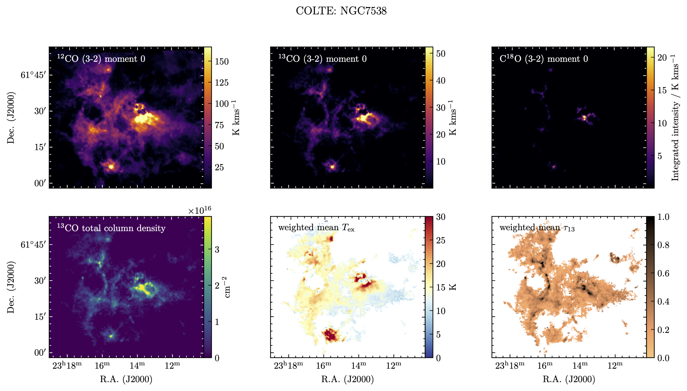

<p align="center">

</p>

# COLTE: CO Local Thermodynamic Equilibrium
A program that produces LTE-based column density cubes from <sup>12</sup>CO, <sup>13</sup>CO (&amp; C<sup>18</sup>O),
largely following the procedure outlined in [Rigby et al. 2019](https://ui.adsabs.harvard.edu/abs/2019A%26A...632A..58R/abstract), which uses COHRS <sup>12</sup>CO and CHIMPS <sup>13</sup>CO and C<sup>18</sup>O 3-2 data.

<p align="center">

</p>
Image: COLTE results for NGC7538 as part of the Perseus Arm Molecular Survey (PAMS; Rigby et al. in prep.)

## Installation
The easiest way to install COLTE is via pip

```
pip install git+https://github.com/ajrigby/COLTE.git
```

## Running COLTE
### Input

COLTE is very simple to run, and requires that you have prepared two things:

1. <sup>12</sup>CO, <sup>13</sup>CO, and C<sup>18</sup>O cubes of the same transition, on the main beam brightness temperature scale, that are at the same angular and spatial resolution, and on the same pixel grid (i.e. same array size and WCS).

2. A parameter file, following the same format as `defaultparams.json` available on this page. The contents of the parameter file are detailed below.

### Run it!

```python 
from colte.LTE import make_cubes

make_cubes('params.json')
```

The code produces three cubes: excitation temperature (T<sub>ex</sub> in units of K), <sup>13</sup>CO optical depth, and <sup>13</sup>CO column density (in units of cm<sup>-2</sup>).


### Parameters:
The performance is controlled by the parameters that are stored in a .json file. The file format is fairly simple, and is simply a Python dictionary. The default parameter file, which you can copy and paste into a text file to get start, contains the following:

```python 
{
    "data_in_12CO": "tmb_12CO.fits",
    "data_in_13CO": "tmb_13CO.fits",
    "data_in_C18O": "tmb_C18O.fits",
    "Tex_mode": 1,
    "single_Tex": 15.0,
    "Tau_mode": 1,   
    "R1318": 6.5, 
    "single_Tau": 1.0,
    "data_out": "colte_",
    "transition": "3-2",
    "snrlim12": 3.0,
    "snrlim13": 3.0,
    "snrlim18": 3.0,
    "fill_method": "rescale",
    "plot_results": 0
}
```


#### Parameter descriptions [data types in brackets]:

`data_in_12CO` [string]: Path to the input <sup>12</sup>CO cube.                                       
`data_in_13CO` [string]: Path to the input <sup>13</sup>CO cube.                                          
`data_in_C18O` [string]: Path to the input C<sup>18</sup>O cube.               
`data_out` [string]: A path prefix for the output files. 

Note that all paths must be given relative to the location in which you are running `colte` (not relative to the location of the parameter file itself).

`transition` [string]: The transition being used.<br>
`snrlim12` [float]: Signal-to-noise ratio threshold for <sup>12</sup>CO.       
`snrlim13` [float]: Signal-to-noise ratio threshold for <sup>13</sup>CO.    
`snrlim18` [float]: Signal-to-noise ratio threshold for C<sup>18</sup>O.            


`Tex_mode` [integer]: A value of `1` will calculate Tex primarily from <sup>12</sup>CO. A value of `2` will adopt single_Tex for all pixels.   
`single_Tex` [float]: The assumed single  excitation temperature adopted if `Tex_mode = 2`.          
`Tau_mode` [integer]: A value of `1` will calculate Tau primarily from <sup>13</sup>CO brightness and T<sub>ex</sub>. A value of `2` will use the low tau assumption with single_Tau. A value of `3` will use the optically thin approximation.  
`R1318` [integer]: Assumed abundance ratio of <sup>13</sup>CO to C<sup>18</sup>O. We refer the reader to [Wilson & Rood 1994](https://ui.adsabs.harvard.edu/abs/1994ARA%26A..32..191W/abstract) for selecting suitable values.<br>
`single_Tau:` [float]: The assumed optical depth for use in Tau_mode 2.  
`fill_method` [string]: Either "interpolate", "median", "rescale" or "none".  
`plot_results` [integer]: If given a value of `1`, a figure will be produced on completion showing the results for the plane containing the brightest emission.

#### Note on fill methods:
The `fill_method` parameter controls how undefined tau values are filled, which sometimes arise as a result of the <sup>13</sup>CO brightness temperature approaching or exceeding the value for <sup>12</sup>CO, which may happen due to non-LTE conditions, such as self absorption, or line-of-sight temperature gradients. Problems may also arise due to observational effects; it is assumed that the input cubes all have the same resolution in all three dimensions, and deviations from this are bound to occur in reality due to imperfect matches of the telescope beams, pointing, or binning on the pixel grid. This can lead to a 'mottling' of the various maps, with beam-sized undulations. These are difficult to avoid because the calculations involve ratios of various versions of the cubes, which produce particularly strong mottling effects at low signal-to-noise ratio (S/N < 25 or so).

I tend to favour the methods that produce fewer artefacts in the tau maps, and therefore recommend the `rescale` method as the default.

The available options are:

* `"interpolate"`: Uses a linear interpolation to fill missing values.  
* `"median"`: Uses a median filter to fill missing values.  
* `"rescale"`: First fills tau values based on the average <sup>13</sup>CO emission to optical depth relationship, and then median filters the map to smooth remove outlying values.  
* `"none"`: will not perform any filling of tau values.

## Caveats and limitations

* The <sup>13</sup>CO optical depth-filling methods requires a bit of fudging due to non-LTE effects, as detailed above.
* May produce erratic results in areas with low S/N, since many quantities are derived from intensity ratios which are particularly sensitive to noise.

## Future releases

* Add flexibility if you are missing e.g. <sup>12</sup>CO or C<sup>18</sup>O cubes.
* Produce some useful quick-look output, such as 2D maps of weighted mean excitation temperature, and integrated column density using a bit of source finding to mask out pure noise artefacts.
* Produce error cubes using Monte Carlo resampling (bootstrapping) of the input data.
* Add functionality to allow the creation of the .json parameter files from within Python.

